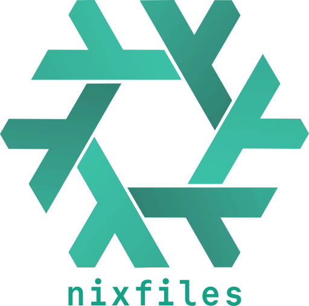

  

personal nixos infrastructure managed with [clan-core](https://docs.clan.lol/). modules are aspect-oriented: feature modules export reusable aspects through `flake.modules.*`, while clan roles and machine imports compose them into concrete systems. the repo covers host configuration, user environments, secrets, storage, networking, and self-hosted services.

## features

- [clan-core](https://docs.clan.lol/) - machine inventory, secrets (sops-nix/age), disk partitioning (disko), service roles and [clan-services](clan-services/)
- [flake-parts](https://flake.parts/) - modular flake framework
- aspect-oriented module structure - feature modules export aspects through `flake.modules.*`, composed through clan roles and machine imports
- [home-manager](https://github.com/nix-community/home-manager) - user environments and desktop integration
- [preservation](https://github.com/nix-community/preservation) - opt-in state persistence with ephemeral roots; see [why preservation over impermanence](docs/decisions/state-persistence.md)
- openwrt home network declarative router/ap management

## machines

| machine       | type        | description                | specs                                                                                          |
| ------------- | ----------- | -------------------------- | ---------------------------------------------------------------------------------------------- |
| simon-desktop | desktop     | daily driver workstation   | dyi: ryzen 7 7800x3d, rx 7800xt, 32gb ddr5                                                     |
| lpt-titan     | laptop      | remote work                | framework 13: ryzen ai 5 340, radeon 840m, 32gb                                                |
| nixbox        | home server | self-hosted services       | dyi: ryzen 7 5700x, 64gb, nvidia rtx pro 4000 backwell sff, 4x6tb + 2x960gb ssd, 2x16gb optane |
| nixworker     | home server | ci, remote builder, cache  | minisforum ms-a2: ryzen 9 9955hx, 96gb ddr5                                                    |
| gateway       | vps         | gw/reverse proxy (netbird) | hetzner cx23: 2vcpu, 4gb ram, 40gb ssd                                                         |

## documentation

- [repo docs](docs/)
  - [decisions](docs/decisions/)
- [machine docs](machines/README.md)
- [nixos search](https://search.nixos.org/)
- [clan-core docs](https://docs.clan.lol/)
- [flake-parts docs](https://flake.parts/)

## credits

- [mic92 dotfiles](https://github.com/Mic92/dotfiles)
- [badele nix-homelab](https://github.com/badele/nix-homelab)
- [pinpox nixos-config](https://github.com/pinpox/nixos)
- [ryan4yin nix-config](https://github.com/ryan4yin/nix-config)
- [fufexan dotfiles](https://github.com/fufexan/dotfiles)
- [NotAShelf nyx](https://github.com/notashelf/nyx)
- [sini nix-config](https://github.com/sini/nix-config)

## license

[WTFPL](LICENSE)
