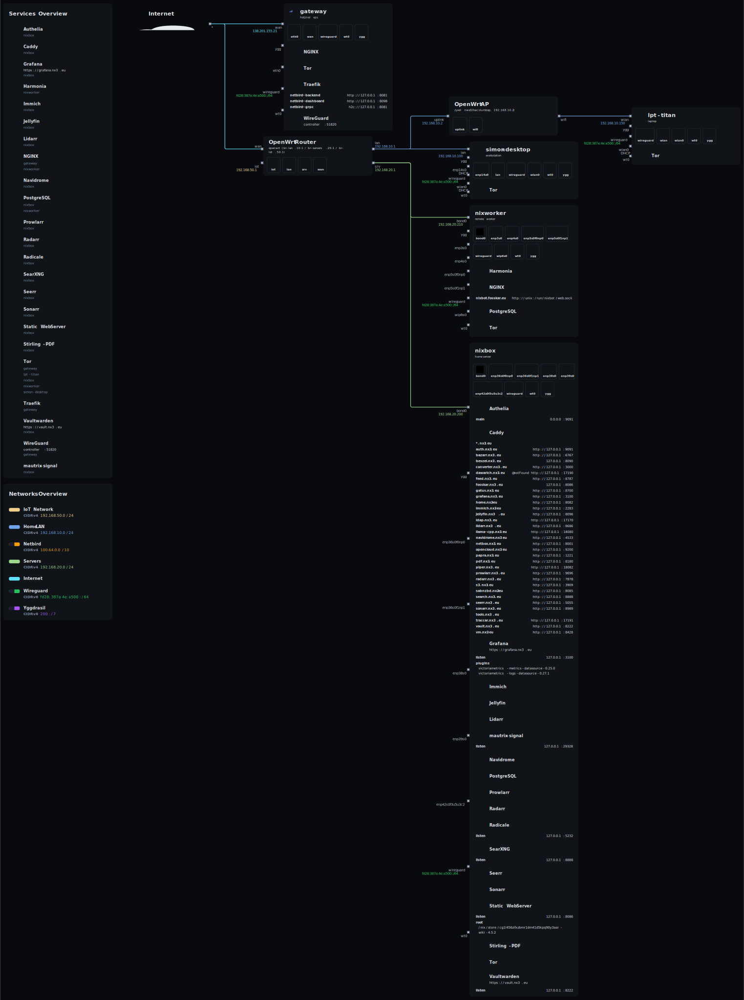
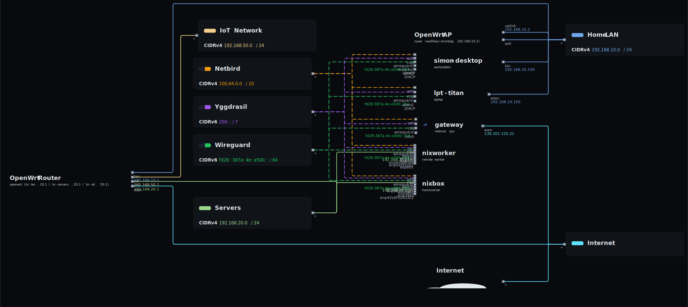

# Topology

Network/service topology of the clan, rendered by
[nix-topology](https://github.com/oddlama/nix-topology).

- Per-host nodes (interfaces, services, IPs) are **derived** from each machine's
  NixOS config — `topology.self` in `machines/<host>/topology.nix`, with host
  IPs read from the static `networking.*` config where one exists.
- The shared graph (OpenWrt router, dumb AP, the internet, and the
  lan/srv/iot networks) is declared centrally in
  `modules/flake-parts/topology.nix` (sourced from `openwrt/devices/*/config.nix`).
- The NixOS extractor and the p2p overlay interfaces (netbird/wireguard/yggdrasil)
  are wired onto every host via `modules/nixos/common/base/topology.nix`.

## Main view



## Network-centric view



## Hosts

| Host          | Interface | Address        | Network | Icon         | Info           |
| ------------- | --------- | -------------- | ------- | ------------ | -------------- |
| gateway       | wan       | 138.201.155.21 | wan     | cloud-server | hetzner vps    |
| nixbox        | bond0     | 192.168.20.200 | srv     | nixos        | home server    |
| nixworker     | bond0     | 192.168.20.210 | srv     | nixos        | remote builder |
| simon-desktop | lan       | 192.168.10.100 | lan     | desktop      | workstation    |
| lpt-titan     | wlan      | 192.168.10.150 | lan     | laptop       | laptop         |

All five hosts also carry the three p2p overlay interfaces (`wt0`/`wireguard`/`ygg`).

## Networks

| Network   | Name        | CIDR                  | Style  |
| --------- | ----------- | --------------------- | ------ |
| lan       | Home LAN    | 192.168.10.0/24       | solid  |
| srv       | Servers     | 192.168.20.0/24       | solid  |
| iot       | IoT Network | 192.168.50.0/24       | solid  |
| wan       | Internet    | —                     | solid  |
| netbird   | Netbird     | 100.64.0.0/10         | dashed |
| wireguard | Wireguard   | fd28:387a:4e:a500::/64 | dashed |
| yggdrasil | Yggdrasil   | 200::/7               | dashed |

The overlays are virtual: they render in the network-centric view (`network.svg`)
and stay out of the physical main view (`main.svg`). gateway is the wireguard
controller / netbird management server (shown as services on its node); yggdrasil
is a pure p2p mesh with no controller.

## Infrastructure (non-NixOS, hand-declared)

| Node   | Device               | Addresses                                                           |
| ------ | -------------------- | ------------------------------------------------------------------- |
| router | OpenWrt Router       | br-lan 192.168.10.1 / br-servers 192.168.20.1 / br-iot 192.168.50.1 |
| ap     | Zyxel NWA50AX (dumb) | 192.168.10.2 (wifi bridged onto br-lan)                             |

## Regenerate

```sh
out=$(nix build .#topology.x86_64-linux.config.output --no-link --print-out-paths)
install -m644 "$out"/main.svg    docs/topology/main.svg
install -m644 "$out"/network.svg docs/topology/network.svg
```
